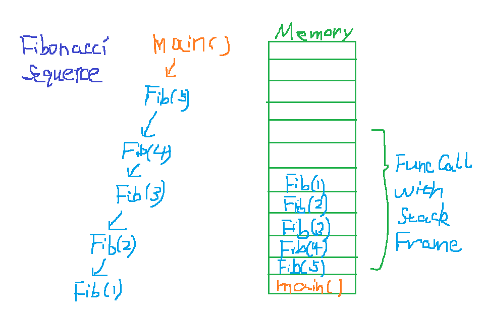

## Recursion Notebooks
I am following this [guy on YouTube](https://www.youtube.com/channel/UClEEsT7DkdVO_fkrBw0OTrA) to review and solid my knowledge on Data Structure and algorithms. His demonstration on each topic is nice, beautiful and excellent!   

### Iterative method for Fibonacci
_Pseudo code_

```
Fib(n)
{
    if(n <= 1)
        return n
    F1 <-- 0
    F2 <-- 1
    for i <-- i to n
        F <-- F1 + F2
        F1 <-- F2
        F2 <-- F
    
    return F
}
```


### Plain recursion
_C++ code for Fibonacci Sequence_
```
#include <iostream>

int Fib(int n) {
    if(n <= 1)
    {
        return n;
    }
    return Fib(n-1) + Fib(n-2);
}

int main()
{
    int n;
    std::cout << "Type an number n: ";
    std::cin >> n;

    int result = Fib(n);
    std::cout << result << std::endl;

    return 0;
}
```

### Recursion with memorization

_Fibonacci Sequence pseudo code_

```
Fib(n)
{
    if n <= 1
        return n
    if Fn is in memory 
        return Fn
    else
        Fn = Fib(n-1) + Fib(n-2)
        Save Fn in memory
        return Fn
}
```

By this way, we are avoiding all the re-calculation of the same state again and again. Here is an [Implementaion Example](fibo_recursion_with_memorization.cpp). Note in this particular example, the recursion with memorization is not as efficient as an iterative implementation in terms of memory but it is as good as an iterative implementation in terms of time for larger values of n. And it is a lot better than simple recursion which grows exponentially with the input.


### Recursion space complexity analysis
We need to understand how recursive program executes in the memory to understand and analyze the memory consumption. A recursive call is not different from a function A calling another function B except for the fact that A and B are same. But in terms of execution, separate memory and resources are allocated to the new function call.  

_Executing Demo_
<p align = "center">
  
</p>

