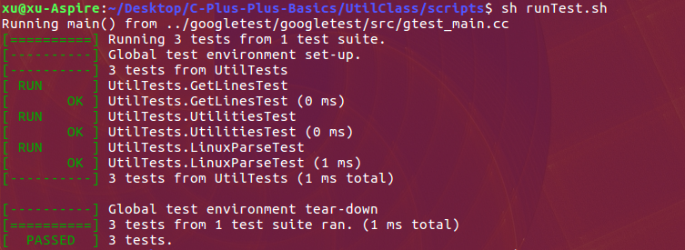

## Installation and Test

### Ubuntu 

```bash
$> cd ~
$> git clone https://github.com/yanxuceo/C-Plus-Plus-Basics.git
$> cd C-Plus-Plus-Basics/UtilClass
$> git clone https://github.com/google/googletest.git
$> mkdir build && cd build
$> cmake ..
$> make
$> cd ../scripts
$> sh runTest.sh
```


### Test result

The test result will be given as below after running the _runTest_ script.
<p align = "left">
  
</p>
